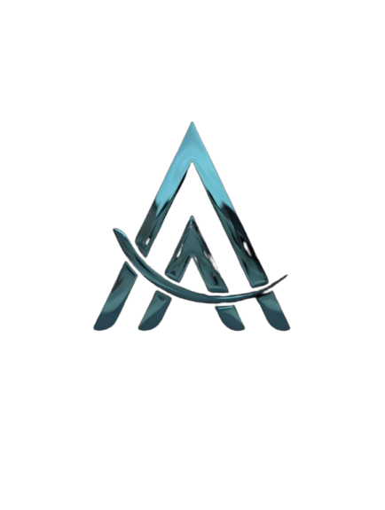

<!-- 
  ██████╗ ██╗   ██╗████████╗██╗  ██╗ ██████╗ ███╗   ██╗
  ██╔══██╗██║   ██║╚══██╔══╝██║  ██║██╔═══██╗████╗  ██║
  ██████╔╝██║   ██║   ██║   ███████║██║   ██║██╔██╗ ██║
  ██╔══██╗██║   ██║   ██║   ██╔══██║██║   ██║██║╚██╗██║
  ██████╔╝╚██████╔╝   ██║   ██║  ██║╚██████╔╝██║ ╚████║
  ╚═════╝  ╚═════╝    ╚═╝   ╚═╝  ╚═╝ ╚═════╝ ╚═╝  ╚═══╝
                                                    
  Full-Stack Developer | Clean, efficient, and user-focused code
-->
 

  

<h3 align="center">Full-Stack Developer • Building modern web apps from UI to database</h3>

  

---

### 🧑‍💻 My Stack

- **Frontend**: HTML, CSS, Bootstrap, Tailwind CSS, JavaScript, React  
- **Backend**: Node.js, RESTful APIs  
- **Databases**: PostgreSQL, MongoDB  
- **Tools**: Git, GitHub, npm, Postman

---

### 🛠️ Tech Showcase

  

---

### 📈 GitHub Stats

  
  

---

### 🌱 Currently

- Building full-stack applications with **clean architecture**
- Focusing on **secure, maintainable, and well-documented APIs**
- Improving UX with responsive, accessible frontend components

---

> 💡 **I write code that works today — and still makes sense a year from now.**

---

### 🤝 Let's Connect

 

---

  

